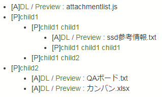

# confl-attachment-list


A attachment list for your Confluence.

## Description

like this:

***DEMO:***



## Usage

1. Add the Children Display macro to a page : [guide](https://confluence.atlassian.com/doc/children-display-macro-139501.html)
2. Add the HTML macro to a page : [guide](https://confluence.atlassian.com/doc/html-macro-38273085.html)
3. Add this script in the HTML macro.
4. Change "baseURL" to your Confluence URL.

```html
<div id="descendants-attachments-list" data-url="this"></div>
<script type="text/javascript">
var baseURL = 'http://hostname';
//OK: var baseURL = 'http://hostname';
//NG: var baseURL = 'http://hostname/';

var apiPreURL = '/rest/api/content/';
var apiPostURL_attach = '/child/attachment?limit=100';
var apiPostURL_page = '/child/page?limit=100';
var $target = $('#descendants-attachments-list');
var root = ( $target.attr('data-url') == 'this' ) ? $('meta[name=ajs-page-id]').attr('content') : $target.attr('data-url');

function attachmentsList(contentId, $t){
$t.append('<ul name="' + contentId +  '"></ul>');
var $tul = $t.find('ul[name='  + contentId +   ']');
$.when(
$.getJSON(baseURL + apiPreURL + contentId +apiPostURL_attach , function(data) {
for(let r in data.results) {
$tul.append('<li>[A]' +
'<a href="' + baseURL + data.results[r]._links.download.toString() + '" download>DL</a> / ' +
'<a href="' + baseURL + data.results[r]._links.webui.toString() + '">Preview</a> : ' +
data.results[r].title.toString() + '</li>');
}
})
).done(function() {
$.getJSON(baseURL + apiPreURL + contentId +apiPostURL_page , function(data) {
for(let r in data.results) {
$tul.append('<li name="' + data.results[r].id + '">[P]' +
'<a href="' + baseURL + data.results[r]._links.tinyui.toString() + ' ">' +
data.results[r].title.toString() + '</a></li>');
attachmentsList(data.results[r].id, $tul);
}
});
});
};

attachmentsList(root, $target);

</script>
```

## Anything Else

- If you want to change the root page, you change "data-url" attribute to the page's content id.
- It has been tested with Confluence Server version 6.1.4

## Author

@nh321
